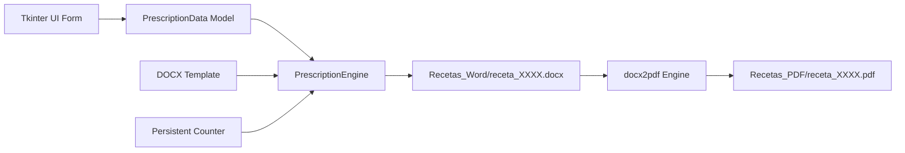

# 🐾 Veterinary Prescription Generator


> **Desktop automation software for issuing, tracking, and rendering formatted veterinary medical prescriptions in DOCX and PDF formats.**

*Versión en Español: [README.md](README.md)*

---

## 🌟 Key Features

* ⚡ **Streamlined Workflow:** Issue structured medical prescriptions rapidly via a clear graphical interface.
* 📅 **Smart Date Autocompletion:** Automatically populates current issuance date on launch.
* 🔢 **Atomic Counter Increment:** Maintains sequential prescription numbers (`0001`, `0002`, etc.) stored in local persistent state.
* 📄 **Dual DOCX & PDF Generation:** Generates editable Word files and compiles final print-ready PDF copies.
* 🔒 **Privacy by Design:**
  * Ships with a sanitized demonstration template (`assets/plantilla_ejemplo.docx`).
  * Production templates containing real clinical credentials and emitted prescription records are strictly excluded via `.gitignore`.
* 🧩 **Clean Architecture:** Decoupled business logic (`PrescriptionEngine`) and UI rendering (`PrescriptionGUI`).

---

## 🏗️ Execution Flow



---

## 📋 System Requirements

* **Operating System:** Windows 10/11 (required for native MS Word PDF compilation).
* **Python:** 3.8 or higher.
* **Microsoft Word:** Required on Windows for headless PDF conversion via `docx2pdf`.

---

## 🚀 Installation

```bash
# Clone the repository
git clone https://github.com/Klopezxd/vet-prescription-generator.git
cd vet-prescription-generator

# Setup virtual environment
python -m venv venv
.\venv\Scripts\activate

# Install dependencies
pip install -r requirements.txt
```

---

## 💻 Usage

Launch the desktop client:

```bash
python main.py
```

### Customizing Your Template:
1. The project defaults to `assets/plantilla_ejemplo.docx`.
2. To use your official clinical header, place your template as `plantilla_receta.docx` in the project root.
3. The engine dynamically maps the following placeholder tags:
   * `{{DIA}}`, `{{MES}}`, `{{ANIO}}`
   * `{{NUM_RECETA}}`
   * `{{ESPECIE}}`, `{{NOMBRE_PACIENTE}}`, `{{SEXO}}`, `{{EDAD}}`
   * `{{NOMBRE_PROPIETARIO}}`, `{{DIRECCION_PROPIETARIO}}`
   * `{{PRESCRIPCION}}`, `{{DIAGNOSTICO}}`, `{{POSOLOGIA}}`, `{{INSTRUCCIONES}}`

---

## 📁 Repository Tree

```text
vet-prescription-generator/
├── .github/
│   └── workflows/
│       └── lint.yml             # CI linting via Ruff
├── assets/
│   └── plantilla_ejemplo.docx   # Sanitized example template
├── src/
│   ├── __init__.py
│   ├── config.py                # System paths and configuration
│   ├── generator.py             # XML template engine and PDF converter
│   └── gui.py                   # Tkinter desktop interface
├── main.py                      # Application entrypoint
├── requirements.txt             # Python requirements
├── .gitignore                   # Excludes private medical records and credentials
├── LICENSE                      # MIT License
├── README.md                    # Documentation in Spanish
└── README.en.md                 # Documentation in English
```

---

## 📄 License & Authorship

* **Author:** [Klever López](https://github.com/Klopezxd)
* **License:** MIT License — Open source for professional, educational, and clinical usage.
