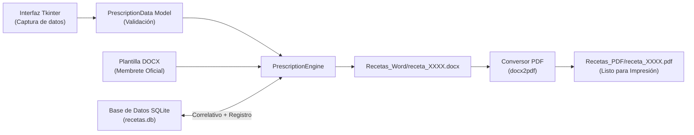

# Generador de Recetas Veterinarias (Normativa Agrocalidad)


> **Sistema de escritorio para la emisión secuencial, auditoría local y exportación de recetas médicas veterinarias conforme a los lineamientos regulatorios de Agrocalidad (Ecuador).**

---

## 📋 Contexto Regulatorio y Propósito

En Ecuador, la **Agencia de Regulación y Control Fito y Zoosanitario (Agrocalidad)** establece la obligatoriedad de emitir y archivar recetas médico-veterinarias para el despacho y control de fármacos e insumos agropecuarios restringidos (antibióticos, biológicos, sedantes y principios activos controlados).

Esta aplicación fue desarrollada específicamente para automatizar y estandarizar el proceso en almacenes agropecuarios y consultorios veterinarios, garantizando:

1. **Cumplimiento del Formato Oficial de Dos Cuerpos:**
   * **Cuerpo 1 (Original — Almacenista):** Contiene los datos del profesional prescriptor (Cédula, N° Registro SENESCYT, Teléfono), número secuencial, fecha, prescripción detallada y diagnóstico. Se archiva en el establecimiento para control de stock e inspecciones de Agrocalidad.
   * **Cuerpo 2 (Duplicado — Propietario del animal):** Contiene la información del paciente, especie, propietario, posología exacta e instrucciones de administración.
   * **Diseño para Impresión Eficiente:** Ambos cuerpos se diagraman en una sola hoja horizontal (formato apaisado), lista para imprimir y dividir al instante.

2. **Numeración Correlativa Inalterable:**
   * Numeración secuencial atómica (`0001`, `0002`, ...) gestionada por base de datos, impidiendo duplicaciones o desfasajes en los libros de control.

3. **Trazabilidad y Auditoría (SQLite):**
   * Cada receta emitida queda registrada en una base de datos relacional local (`recetas.db`), permitiendo búsquedas rápidas ante consultas de clientes o fiscalizaciones oficiales.

---

## 🏗️ Flujo de Trabajo



---

## 🌟 Características Principales

* ⚡ **Despacho Rápido en Mostrador:** Captura completa de datos y emisión en menos de 30 segundos.
* 📅 **Autocompletado de Fecha:** Precarga automáticamente el día, mes y año actual al iniciar la aplicación.
* 🗄️ **Base de Datos SQLite Integrada:** Sin necesidad de configurar servidores externos. Registro histórico permanente y protegido.
* 📄 **Doble Formato (DOCX y PDF):** Genera la versión editable en Word y el documento final en PDF para envío digital o impresión física.
* 🔒 **Seguridad y Privacidad por Diseño:**
  * Incluye una plantilla modelo sanitizada (`assets/plantilla_ejemplo.docx`).
  * Las plantillas reales con firmas o credenciales y las recetas emitidas están estrictamente ignoradas en `.gitignore`.
* 🧩 **Arquitectura Limpia (Clean Code):** Separación total entre la interfaz (`PrescriptionGUI`), el motor de inyección (`PrescriptionEngine`) y la capa de persistencia (`DatabaseManager`).

---

## 📋 Requisitos del Sistema

* **Sistema Operativo:** Windows 10 u 11.
* **Python:** 3.10 o superior.
* **Microsoft Word:** Requerido en Windows para la conversión automática desatendida a PDF (`docx2pdf`). Si Word no está presente, la aplicación genera el documento `.docx` sin interrumpir la operación.

---

## 🚀 Instalación y Puesta en Marcha

```powershell
# 1. Clonar el repositorio
git clone https://github.com/Klopezxd/vet-prescription-generator.git
cd vet-prescription-generator

# 2. Crear y activar entorno virtual
python -m venv venv
.\venv\Scripts\activate

# 3. Instalar dependencias
pip install -r requirements.txt

# 4. Iniciar la aplicación
python main.py
```

---

## ⚙️ Configuración de la Plantilla de Agrocalidad

1. El sistema utiliza por defecto la plantilla sanitizada de `assets/plantilla_ejemplo.docx`.
2. Para vincular el membrete oficial del establecimiento o profesional:
   * Coloca tu documento diseñado como **`plantilla_receta.docx`** en la carpeta raíz del proyecto.
3. Los marcadores automáticos (*placeholders*) reconocidos por el motor son:
   * **Fechas y correlativo:** `{{DIA}}`, `{{MES}}`, `{{ANIO}}`, `{{NUM_RECETA}}`
   * **Paciente:** `{{ESPECIE}}`, `{{NOMBRE_PACIENTE}}`, `{{SEXO}}`, `{{EDAD}}`
   * **Propietario:** `{{NOMBRE_PROPIETARIO}}`, `{{DIRECCION_PROPIETARIO}}`
   * **Tratamiento:** `{{PRESCRIPCION}}`, `{{DIAGNOSTICO}}`, `{{POSOLOGIA}}`, `{{INSTRUCCIONES}}`

---

## 📁 Estructura del Proyecto

```text
vet-prescription-generator/
├── .github/
│   └── workflows/
│       └── lint.yml             # Integración continua con Ruff
├── assets/
│   └── plantilla_ejemplo.docx   # Plantilla base sanitizada
├── src/
│   ├── __init__.py
│   ├── config.py                # Configuración de rutas y archivos
│   ├── database.py              # Capa de persistencia SQLite y auditoría
│   ├── generator.py             # Motor de renderizado XML y exportación
│   └── gui.py                   # Interfaz de usuario Tkinter
├── main.py                      # Punto de entrada principal
├── pyproject.toml               # Metadatos y reglas del linter Ruff
├── requirements.txt             # Dependencias del proyecto
├── .gitignore                   # Excluye recetas emitidas, BD y credenciales
├── LICENSE                      # Licencia MIT
└── README.md                    # Documentación principal en español
```

---

## 📄 Licencia y Autoría

* **Autor:** [Klever López](https://github.com/Klopezxd)
* **Licencia:** Licencia MIT — Código abierto para fines profesionales, clínicos y educativos.
