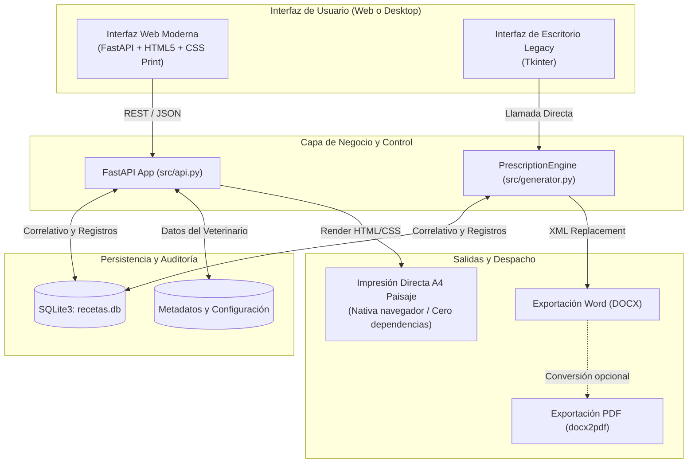

# Generador de Recetas Veterinarias (Normativa Agrocalidad Ecuador)


-brightgreen.svg)


> **Sistema clínico y comercial para la emisión secuencial, previsualización en vivo, auditoría local e impresión de recetas médico-veterinarias conforme a las exigencias regulatorias de Agrocalidad (Ecuador).**

---

## 📋 Contexto Regulatorio y Propósito

En Ecuador, la **Agencia de Regulación y Control Fito y Zoosanitario (Agrocalidad)** exige que el expendio de medicamentos de control especial (antibióticos, hormonales, biológicos, anestésicos y sustancias restringidas) se realice obligatoriamente mediante una **receta médico-veterinaria oficial**.

Esta plataforma fue diseñada para agilizar y digitalizar el flujo de trabajo en farmacias veterinarias, distribuidoras de insumos agropecuarios y consultorios clínicos, resolviendo dos problemas fundamentales:

1. **Formato Oficial de Dos Cuerpos en una Sola Hoja A4 Horizontal:**
   * **Cuerpo 1 (Original — Almacenista):** Datos del médico prescriptor (Cédula, N° Registro SENESCYT, Teléfono de contacto), número secuencial de control, fecha, diagnóstico presuntivo y prescripción farmacológica. Se archiva en el establecimiento para control de inventario e inspecciones de Agrocalidad.
   * **Cuerpo 2 (Duplicado — Propietario del animal):** Datos del paciente, especie, propietario, dosificación, posología detallada e indicaciones de administración.
   * **Impresión Inmediata (<50 ms):** Ambos cuerpos se diagraman en una sola hoja A4 en orientación apaisada con líneas de corte y sellos, optimizado mediante reglas de `@media print` y `@page` nativas del navegador, eliminando por completo la dependencia y demoras de Microsoft Word.

2. **Numeración Secuencial Inalterable y Auditoría (SQLite):**
   * Correlativo atómico autoincremental (`0001`, `0002`, ...) protegido a nivel de base de datos.
   * Búsqueda instantánea de recetas anteriores por nombre de cliente, paciente o fármaco administrado ante inspecciones sanitarias o reclamos post-venta.

---

## 🏗️ Arquitectura del Sistema



---

## 🌟 Características Principales

* ⚡ **Previsualización en Tiempo Real (WYSIWYG):** Mientras se digita la información en el formulario, el documento oficial de dos cuerpos se actualiza instantáneamente en pantalla con el diseño exacto que saldrá de la impresora.
* 🐾 **Chips de Especie Rápida:** Botones de acceso directo con un clic para especies frecuentes: Bovino, Porcino, Equino, Canino, Felino, Ovino, Caprino y Aves.
* 🖨️ **Impresión Ultrarrápida sin Microsoft Word:** Diseñado con estándares CSS Print (`@page { size: A4 landscape; margin: 4mm; }`), imprime o guarda en PDF vectorial en menos de 50 milisegundos desde cualquier navegador.
* 👨‍⚕️ **Perfil del Médico Veterinario Configurable:** Pestaña de ajustes para almacenar en SQLite el nombre del profesional, Cédula de Identidad, Registro SENESCYT, teléfono y nombre del establecimiento o clínica.
* 🔍 **Módulo de Auditoría y Búsqueda:** Historial completo con filtrado en tiempo real por número de receta, propietario, paciente o medicamento recetado.
* 🌐 **Compatibilidad en Red Local:** Permite emitir recetas desde computadoras de mostrador, laptops o tablets conectadas a la misma red WiFi del local.
* 🔒 **Privacidad de Datos Clínicos:** La base de datos (`recetas.db`), documentos emitidos y membretes con firmas están rigurosamente excluidos en `.gitignore`.
* 💻 **Modo Dual:** Interfaz Web moderna recomendada + Interfaz de escritorio Tkinter clásica disponible.

---

## 📋 Requisitos del Sistema

* **Sistema Operativo:** Windows 10 / 11 (o Linux/macOS para el modo web).
* **Python:** 3.10 o superior instalado.
* **Navegador Web:** Chrome, Edge, Firefox, Brave o cualquier navegador moderno.
* *(Opcional)* Microsoft Word: Requerido únicamente si se utiliza la interfaz clásica Tkinter con conversión automática a PDF vía `docx2pdf`.

---

## 🚀 Instalación y Puesta en Marcha

### 1. Clonar el Repositorio e Instalar Dependencias

```powershell
# Clonar el proyecto
git clone https://github.com/Klopezxd/vet-prescription-generator.git
cd vet-prescription-generator

# Crear y activar entorno virtual
python -m venv venv
.\venv\Scripts\activate

# Instalar dependencias
pip install -r requirements.txt
```

### 2. Ejecutar la Aplicación

#### Opción A: Ejecutable Portable de Escritorio (Recomendado para Usuario Final / Mostrador)
* **100% Autónomo:** No requiere instalar Python ni librerías en la máquina de destino.
* **Cero Consolas:** Abre directamente una ventana nativa de aplicación (`--noconsole`) con el icono oficial veterinario.
* **Ubicación:** Haz doble clic en el archivo generado:
  ```text
  dist/Recetario_Agrocalidad.exe
  ```
  *(Puedes copiar este único archivo `.exe` al Escritorio de cualquier PC con Windows 10/11 y funcionará al instante).*
* **Compilación:** Para regenerar el ejecutable tras cualquier cambio en el código, haz doble clic en **`build_exe.bat`**.

#### Opción B: Inicio Rápido de Servidor Local (Windows)
Haz doble clic sobre el archivo **`iniciar_recetario.bat`**. 
El script activará el entorno virtual, iniciará el servidor local y abrirá automáticamente tu navegador en `http://localhost:8000`.

#### Opción C: Inicio Manual por Terminal (Modo Web)
```powershell
python -m uvicorn src.api:app --reload --host 0.0.0.0 --port 8000
```
Luego abre en tu navegador: **`http://localhost:8000`**

#### Opción D: Modo Clásico de Escritorio (Tkinter)
```powershell
python main.py
```

---

## 📁 Estructura del Repositorio

```text
vet-prescription-generator/
├── .github/
│   └── workflows/
│       └── lint.yml             # Integración continua con Ruff
├── assets/
│   ├── app_icon.ico             # Icono oficial veterinario multirresolución
│   └── plantilla_ejemplo.docx   # Plantilla base sanitizada para modo Word
├── src/
│   ├── __init__.py
│   ├── api.py                   # API REST y servidor web FastAPI
│   ├── config.py                # Rutas dinámicas y compatibilidad PyInstaller
│   ├── database.py              # Capa de persistencia SQLite y auditoría
│   ├── generator.py             # Motor de renderizado DOCX/PDF
│   ├── gui.py                   # Interfaz gráfica de escritorio Tkinter
│   ├── static/
│   │   ├── css/
│   │   │   └── app.css          # Estilos de pantalla y reglas @media print A4
│   │   └── js/
│   │       └── app.js           # Lógica interactiva y comunicación con la API
│   └── templates/
│       └── index.html           # Vista principal con formulario y hoja oficial
├── build_exe.bat                # Script de compilación automática del ejecutable
├── desktop.py                   # Lanzador de escritorio nativo (FastAPI + App Mode)
├── iniciar_recetario.bat        # Lanzador web para Windows (1 clic)
├── main.py                      # Punto de entrada para el modo Tkinter
├── pyproject.toml               # Configuración del linter Ruff (PEP 8)
├── requirements.txt             # Dependencias del proyecto
├── .gitignore                   # Excluye recetas emitidas, base de datos y firmas
├── LICENSE                      # Licencia de código abierto MIT
└── README.md                    # Documentación técnica y funcional
```


---

## 🛡️ Calidad de Código y Estándares

El proyecto aplica estándares estrictos de desarrollo:
* **Linter y Formateador:** [Ruff](https://docs.astral.sh/ruff/) con 0 advertencias o errores de estilo.
* **Separación de Responsabilidades:** Capas independientes para UI, control de rutas, lógica de negocio y base de datos relacional.
* **Manejo Seguro de Conexiones:** Conexiones SQLite con context managers (`with`) y bloqueo transaccional para evitar condiciones de carrera en el número secuencial.

---

## 📄 Licencia y Créditos

* **Desarrollador:** [Klever López](https://github.com/Klopezxd)
* **Licencia:** Distribuido bajo la [Licencia MIT](LICENSE). Libre para uso comercial, agropecuario y adaptaciones clínicas.

