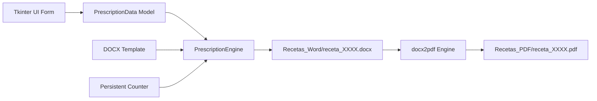

# Veterinary Prescription Generator


> Desktop automation software for issuing, tracking, and rendering formatted veterinary medical prescriptions in DOCX and PDF formats.

*Leer este documento en Español: [README.es.md](README.es.md)*

---

## Key Features

* **Streamlined Workflow:** Issue structured medical prescriptions rapidly via a clear graphical interface.
* **Smart Date Autocompletion:** Automatically populates current issuance date on launch.
* **Atomic Counter Increment:** Maintains sequential prescription numbers (`0001`, `0002`, etc.) stored in local persistent state.
* **Dual DOCX & PDF Generation:** Generates editable Word files and compiles final print-ready PDF copies.
* **Privacy by Design:**
  * Ships with a sanitized demonstration template (`assets/plantilla_ejemplo.docx`).
  * Production templates containing real clinical credentials and emitted prescription records are strictly excluded via `.gitignore`.
* **Clean Architecture:** Decoupled business logic (`PrescriptionEngine`) and UI rendering (`PrescriptionGUI`).

---

## Execution Flow



---

## System Requirements

* **Operating System:** Windows 10/11 (required for native MS Word PDF compilation).
* **Python:** 3.10 or higher.
* **Microsoft Word:** Required on Windows for headless PDF conversion via `docx2pdf` (if Word is not installed, the DOCX file is generated gracefully without interruption).

---

## Installation

```bash
# 1. Clone the repository
git clone https://github.com/Klopezxd/vet-prescription-generator.git
cd vet-prescription-generator

# 2. Setup virtual environment (recommended)
python -m venv venv
.\venv\Scripts\activate

# 3. Install dependencies
pip install -r requirements.txt
```

---

## Usage

Launch the desktop client:

```bash
python main.py
```

### Customizing Your Template:
1. The project defaults to `assets/plantilla_ejemplo.docx`.
2. To use your official clinical header, place your template as `plantilla_receta.docx` in the project root.
3. The engine dynamically maps the following placeholder tags:
   * `{{DIA}}`, `{{MES}}`, `{{ANIO}}`
   * `{{NUM_RECETA}}`
   * `{{ESPECIE}}`, `{{NOMBRE_PACIENTE}}`, `{{SEXO}}`, `{{EDAD}}`
   * `{{NOMBRE_PROPIETARIO}}`, `{{DIRECCION_PROPIETARIO}}`
   * `{{PRESCRIPCION}}`, `{{DIAGNOSTICO}}`, `{{POSOLOGIA}}`, `{{INSTRUCCIONES}}`

---

## Repository Structure

```text
vet-prescription-generator/
├── .github/
│   └── workflows/
│       └── lint.yml             # CI linting via Ruff
├── assets/
│   └── plantilla_ejemplo.docx   # Sanitized example template
├── src/
│   ├── __init__.py
│   ├── config.py                # System paths and configuration
│   ├── generator.py             # XML template engine and PDF converter
│   └── gui.py                   # Tkinter desktop interface
├── main.py                      # Application entrypoint
├── pyproject.toml               # Project metadata and Ruff configuration
├── requirements.txt             # Python requirements
├── .gitignore                   # Excludes private medical records and credentials
├── LICENSE                      # PolyForm Noncommercial 1.0.0 License
├── README.md                    # English documentation (default)
└── README.es.md                 # Spanish documentation
```

---

## License & Authorship

* **Author:** [Klever López](https://github.com/Klopezxd)
* **License:** PolyForm Noncommercial 1.0.0 License — For educational and non-commercial portfolio evaluation only.
