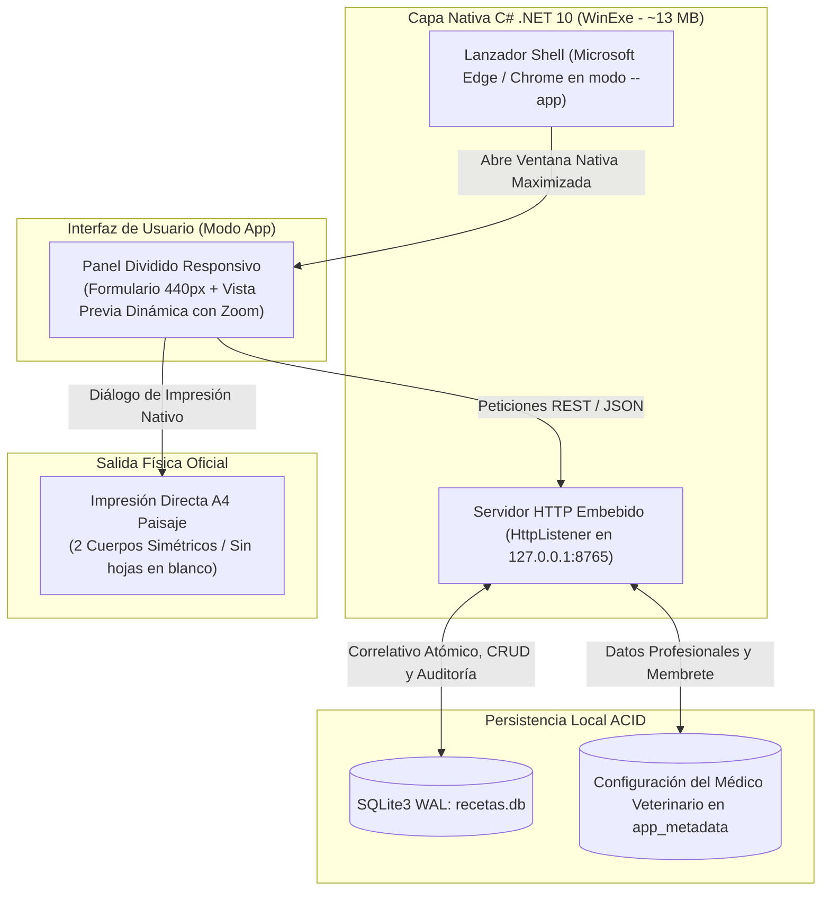

# Generador de Recetas Veterinarias (Normativa Agrocalidad Ecuador)

[](https://github.com/Klopezxd/vet-prescription-generator/releases/latest)
[](https://github.com/Klopezxd/vet-prescription-generator/actions/workflows/lint.yml)
[](https://github.com/Klopezxd/vet-prescription-generator/actions/workflows/release.yml)

-0078D6.svg?logo=windows&logoColor=white)

-brightgreen.svg)
-success.svg)


> **Sistema clínico y comercial autónomo de alto rendimiento para la emisión secuencial, previsualización en vivo, auditoría local e impresión física de recetas médico-veterinarias conforme a la normativa oficial de Agrocalidad (Ecuador).**

---

## ⚡ Descarga Rápida (Para Usuarios Finales)

No es necesario instalar .NET, dependencias ni compilar código. El sistema se distribuye como un único ejecutable autónomo (`Single-File`) compilado y empaquetado automáticamente por GitHub Actions.

👉 **[Descargar la última versión de Recetario_Agrocalidad.exe](https://github.com/Klopezxd/vet-prescription-generator/releases/latest)**

1. Descarga `Recetario_Agrocalidad.exe` (o el `.zip` correspondiente).
2. Haz doble clic en el archivo para iniciar la aplicación.
3. Se abrirá automáticamente una ventana optimizada sin barras de navegador (`Edge --app`), lista para emitir recetas.

---

## 📋 Contexto Regulatorio y Propósito

En Ecuador, la **Agencia de Regulación y Control Fito y Zoosanitario (Agrocalidad)** exige que el expendio de medicamentos veterinarios bajo prescripción (antibióticos, biológicos, hormonales, anestésicos y sustancias controladas) se realice obligatoriamente mediante una **receta médico-veterinaria oficial**.

Esta plataforma digitaliza y acelera el flujo de trabajo en consultorios, distribuidoras de insumos agropecuarios y farmacias veterinarias:

1. **Formato Oficial de Dos Cuerpos en una Sola Hoja A4 Horizontal:**
   * **Cuerpo 1 (Original — Almacenista):** Datos del médico prescriptor (Cédula, N° Registro SENESCYT, Teléfono), secuencial oficial de control, fecha, diagnóstico presuntivo y prescripción farmacológica. Se archiva para fiscalización e inventario.
   * **Cuerpo 2 (Duplicado — Propietario del animal):** Datos del paciente, especie, propietario, dosificación, posología detallada e instrucciones de administración.
   * **Impresión Física Inmediata (<50 ms):** Ambos cuerpos se diagraman en una sola hoja A4 apaisada con línea de corte manual central y sellos, optimizados mediante reglas CSS Print nativas (`@page { size: A4 landscape; margin: 4mm; }`), eliminando desfases de formato y la lentitud de procesadores de texto externos.

2. **Numeración Secuencial Inalterable y Auditoría (SQLite):**
   * Correlativo atómico autoincremental (`0001`, `0002`, ...) protegido con transacciones ACID en modo WAL.
   * Módulos de edición, anulación oficial (con justificación auditada) y reactivación sin romper la secuencia correlativa.
   * Exportación y restauración en caliente de respaldos de la base de datos en 1 clic.

---

## 🏗️ Arquitectura Técnica (C# .NET 10 Nativo)



---

## 🌟 Características Principales

* ⚡ **Previsualización en Vivo con Zoom Interactivo:** Vista dividida (*Split View*) permanente. Mientras se digitan los campos, el documento oficial se renderiza en tiempo real idéntico al resultado impreso, con controles interactivos de escala (50% a 150%) y ajuste automático a pantalla completa.
* 🐾 **Chips de Especie Rápida:** Acceso inmediato con un clic para especies habituales: Bovino, Porcino, Equino, Canino, Felino, Ovino, Caprino y Aves.
* 🖨️ **Impresión Directa Calibrada a 1 Hoja:** Reglas CSS `@media print` de alta precisión que garantizan exactamente una página física en cualquier impresora, sin márgenes excesivos ni páginas sobrantes en blanco.
* ✏️ **Ciclo de Vida y Gestión Histórica de Recetas:**
  * **Editar:** Corrección de datos clínicos conservando el número correlativo original.
  * **Anular:** Marcado oficial como `ANULADA` con motivo de auditoría requerido por inspectores de Agrocalidad.
  * **Reactivar:** Restauración instantánea de recetas anuladas por error.
  * **Eliminar:** Limpieza de registros de prueba.
* 📦 **Copias de Seguridad en Caliente:** Respaldo completo de la base de datos (`.db`) descargable y módulo de restauración integral con validación de esquema.
* 👨‍⚕️ **Membrete Profesional Parametrizable:** Configuración persistente del nombre del médico veterinario, número de cédula, registro SENESCYT, teléfono y clínica.
* 🧪 **Calidad y Cobertura de Pruebas (QA):** Suite de **28 pruebas automatizadas** que validan integridad referencial, transacciones concurrentes con múltiples hilos (estrés SQLite), endpoints REST y reglas de negocio.

---

## 🔄 Automatización CI/CD y Generación de Versiones

El repositorio incluye dos flujos de trabajo en **GitHub Actions**:

1. **`lint.yml` (Calidad Continua):**
   * Se ejecuta en cada `push` o `pull_request` a la rama `main`.
   * Restaura, compila y ejecuta la suite de 28 pruebas automatizadas en un entorno Windows nativo.
2. **`release.yml` (Publicación Automática de Ejecutables):**
   * Se dispara automáticamente al crear un tag de versión (`v1.0.0`, `v1.1.0`, etc.) o manualmente desde la pestaña **Actions** con el botón **Run workflow**.
   * Compila el binario autónomo `Single-File Trimmed AOT` en .NET 10.
   * Genera el ejecutable `Recetario_Agrocalidad.exe` y el paquete `Recetario_Agrocalidad_win-x64.zip`.
   * Publica automáticamente una **GitHub Release** pública con las notas de versión y los archivos descargables listos para el usuario final.

### Cómo publicar una nueva versión:
```bash
# Método 1: Mediante etiquetas de Git
git tag v1.0.0
git push origin v1.0.0

# Método 2: Desde la web de GitHub
# Ve a Actions -> Release Executable -> Run workflow -> Ingresa el tag y ejecuta.
```

---

## 💻 Entorno de Desarrollo Local

### Requisitos:
* [.NET 10 SDK](https://dotnet.microsoft.com/download/dotnet/10.0) (o superior).
* Windows 10 u 11 (64 bits).

### Comandos de Desarrollo:
```powershell
# 1. Ejecutar en modo desarrollo
dotnet run

# 2. Ejecutar la suite de pruebas automatizadas (28 tests)
dotnet test tests/RecetarioAgrocalidad.Tests/RecetarioAgrocalidad.Tests.csproj

# 3. Compilar el ejecutable autónomo localmente
.\build_exe.bat
```

---

## 📄 Licencia

Este proyecto está bajo la Licencia MIT. Consulta el archivo `LICENSE` para más detalles.
