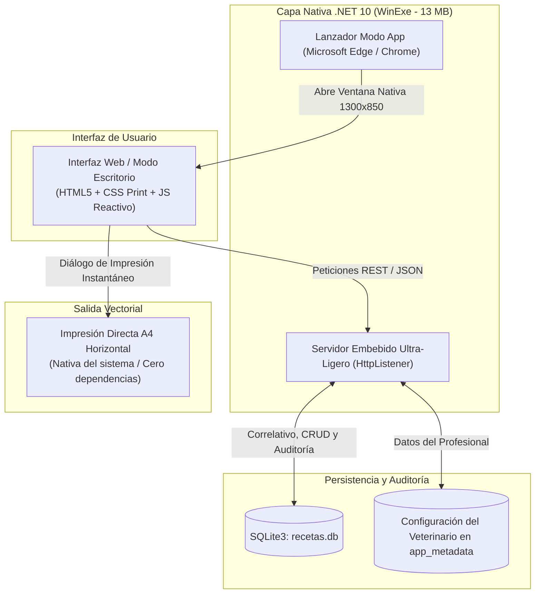

# Generador de Recetas Veterinarias (Normativa Agrocalidad Ecuador)


-0078D6.svg?logo=windows&logoColor=white)


-brightgreen.svg)


> **Sistema clínico y comercial nativo para la emisión secuencial, previsualización en vivo, auditoría local e impresión de recetas médico-veterinarias conforme a las exigencias regulatorias de Agrocalidad (Ecuador).**

---

## 📋 Contexto Regulatorio y Propósito

En Ecuador, la **Agencia de Regulación y Control Fito y Zoosanitario (Agrocalidad)** exige que el expendio de medicamentos de control especial (antibióticos, hormonales, biológicos, anestésicos y sustancias restringidas) se realice obligatoriamente mediante una **receta médico-veterinaria oficial**.

Esta plataforma fue diseñada para agilizar y digitalizar el flujo de trabajo en farmacias veterinarias, distribuidoras de insumos agropecuarios y consultorios clínicos, resolviendo dos problemas fundamentales:

1. **Formato Oficial de Dos Cuerpos en una Sola Hoja A4 Horizontal:**
   * **Cuerpo 1 (Original — Almacenista):** Datos del médico prescriptor (Cédula, N° Registro SENESCYT, Teléfono de contacto), número secuencial de control, fecha, diagnóstico presuntivo y prescripción farmacológica. Se archiva en el establecimiento para control de inventario e inspecciones de Agrocalidad.
   * **Cuerpo 2 (Duplicado — Propietario del animal):** Datos del paciente, especie, propietario, dosificación, posología detallada e indicaciones de administración.
   * **Impresión Inmediata (<50 ms):** Ambos cuerpos se diagraman en una sola hoja A4 en orientación apaisada con líneas de corte y sellos, optimizado mediante reglas de `@media print` y `@page` nativas del navegador, eliminando por completo la dependencia y demoras de Microsoft Word.

2. **Numeración Secuencial Inalterable y Auditoría (SQLite):**
   * Correlativo atómico autoincremental (`0001`, `0002`, ...) protegido a nivel de base de datos.
   * Modificación, anulación oficial y eliminación de registros históricos sin desfasar la numeración.
   * Descarga y restauración de copias de seguridad de la base de datos en 1 clic.

---

## 🏗️ Arquitectura del Sistema (C# .NET 10 Nativo)



---

## 🌟 Características Principales

* ⚡ **Previsualización en Tiempo Real (WYSIWYG):** Mientras se digita la información en el formulario, el documento oficial de dos cuerpos se actualiza instantáneamente en pantalla con el diseño exacto que saldrá de la impresora.
* 🐾 **Chips de Especie Rápida:** Botones de acceso directo con un clic para especies frecuentes: Bovino, Porcino, Equino, Canino, Felino, Ovino, Caprino y Aves.
* 🖨️ **Impresión Ultrarrápida sin Microsoft Word:** Diseñado con estándares CSS Print (`@page { size: A4 landscape; margin: 4mm; }`), imprime o guarda en PDF vectorial en menos de 50 milisegundos.
* ✏️ **Módulo Completo de Gestión Histórica:**
  * **Editar:** Permite corregir errores de digitación en recetas pasadas conservando su número secuencial.
  * **Anular (Agrocalidad):** Marca la receta como anulada con motivo de auditoría sin dejar huecos en la numeración correlativa.
  * **Eliminar:** Borra registros de prueba.
* 📦 **Copias de Seguridad y Restauración:** Botones en la interfaz para descargar un respaldo completo de la base de datos (`.db`) o restaurar una copia previa al cambiar de equipo.
* 👨‍⚕️ **Perfil del Médico Veterinario Configurable:** Pestaña de ajustes para almacenar en SQLite el nombre del profesional, Cédula de Identidad, Registro SENESCYT, teléfono y nombre del establecimiento o clínica.
* 🔒 **Privacidad de Datos Clínicos:** La base de datos (`recetas.db`), backups y documentos emitidos están rigurosamente excluidos en `.gitignore`.

---

## 📋 Requisitos del Sistema

* **Para Desarrolladores:** .NET 10 SDK (o posterior).
* **Para el Usuario Final (con el `.exe`):** Windows 10 u 11 (64 bits). **No requiere instalar ningún runtime ni configuración adicional.**

---

## 🚀 Puesta en Marcha

### Modo Desarrollo
```powershell
# Ejecutar directamente con .NET
dotnet run

# O simplemente hacer doble clic en:
iniciar_recetario.bat
```

### Compilación del Ejecutable Autónomo (.exe)
```powershell
# Compilar en 1 solo archivo recortado (13 MB)
.\build_exe.bat
```
El binario resultante se genera en `dist\Recetario_Agrocalidad.exe`.

---

## 📄 Licencia

Distribuido bajo la Licencia MIT. Consulta el archivo `LICENSE` para más información.
