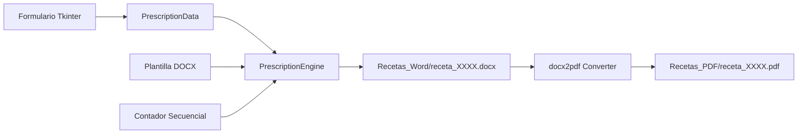

# 🐾 Generador de Recetas Veterinarias


> **Aplicación de escritorio para la automatización, emisión secuencial y exportación (Word y PDF) de recetas médicas veterinarias a partir de plantillas personalizables.**

*Read this in English: [README.en.md](README.en.md)*

---

## 🌟 Características

* ⚡ **Emisión Ágil:** Rellena y genera recetas veterinarias completas en segundos mediante una interfaz gráfica intuitiva.
* 📅 **Autocompletado de Fecha:** Carga automáticamente el día, mes y año actual al abrir la aplicación, minimizando tareas repetitivas.
* 🔢 **Numeración Secuencial:** Administra un contador incremental automático (`0001`, `0002`, etc.) persistido en archivo local.
* 📄 **Doble Exportación Automática:** Genera el documento editable en `.docx` y su respectiva versión final en `.pdf` (vía `docx2pdf`).
* 🔒 **Seguridad y Privacidad por Diseño:**
  * Incluye una plantilla modelo sanitizada (`assets/plantilla_ejemplo.docx`).
  * Las plantillas reales con firmas o credenciales profesionales y las recetas emitidas están estrictamente protegidas mediante `.gitignore`.
* 🧩 **Arquitectura Modular (Clean Code):** Desacoplamiento total entre el motor de inyección de datos (`PrescriptionEngine`) y la interfaz visual (`PrescriptionGUI`).

---

## 🏗️ Flujo de Procesamiento



---

## 📋 Requisitos del Sistema

* **Sistema Operativo:** Windows 10 u 11 (recomendado para la conversión nativa a PDF).
* **Python:** 3.8 o superior.
* **Microsoft Word:** Requerido en Windows para la conversión automática a PDF mediante la librería `docx2pdf`. (Si Word no está presente, la aplicación genera el archivo `.docx` sin interrumpir la ejecución).

---

## 🚀 Instalación

```bash
# 1. Clonar el repositorio
git clone https://github.com/Klopezxd/vet-prescription-generator.git
cd vet-prescription-generator

# 2. Crear y activar entorno virtual (opcional pero recomendado)
python -m venv venv
.\venv\Scripts\activate

# 3. Instalar dependencias
pip install -r requirements.txt
```

---

## 💻 Uso

Ejecuta la aplicación principal:

```bash
python main.py
```

### Configurar tu Plantilla Personalizada:
1. El proyecto utiliza por defecto `assets/plantilla_ejemplo.docx`.
2. Para usar tu propio membrete profesional, coloca tu archivo Word con el nombre `plantilla_receta.docx` en la raíz del proyecto.
3. Asegúrate de incluir los siguientes placeholders en el diseño de tu documento:
   * `{{DIA}}`, `{{MES}}`, `{{ANIO}}`
   * `{{NUM_RECETA}}`
   * `{{ESPECIE}}`, `{{NOMBRE_PACIENTE}}`, `{{SEXO}}`, `{{EDAD}}`
   * `{{NOMBRE_PROPIETARIO}}`, `{{DIRECCION_PROPIETARIO}}`
   * `{{PRESCRIPCION}}`, `{{DIAGNOSTICO}}`, `{{POSOLOGIA}}`, `{{INSTRUCCIONES}}`

*(El archivo `plantilla_receta.docx` está en `.gitignore` para garantizar que tus datos profesionales nunca se suban a internet).*

---

## 📁 Estructura del Proyecto

```text
vet-prescription-generator/
├── .github/
│   └── workflows/
│       └── lint.yml             # Integración continua con Ruff
├── assets/
│   └── plantilla_ejemplo.docx   # Plantilla modelo sanitizada
├── src/
│   ├── __init__.py
│   ├── config.py                # Rutas y configuración centralizada
│   ├── generator.py             # Motor de renderizado XML y conversión PDF
│   └── gui.py                   # Interfaz de usuario Tkinter
├── main.py                      # Punto de entrada de la aplicación
├── requirements.txt             # Dependencias
├── .gitignore                   # Protección de recetas y datos personales
├── LICENSE                      # Licencia MIT
├── README.md                    # Documentación en Español
└── README.en.md                 # Documentación en Inglés
```

---

## 📄 Licencia y Autoría

* **Autor:** [Klever López](https://github.com/Klopezxd)
* **Licencia:** MIT License — libre para uso educativo, profesional y comercial.
